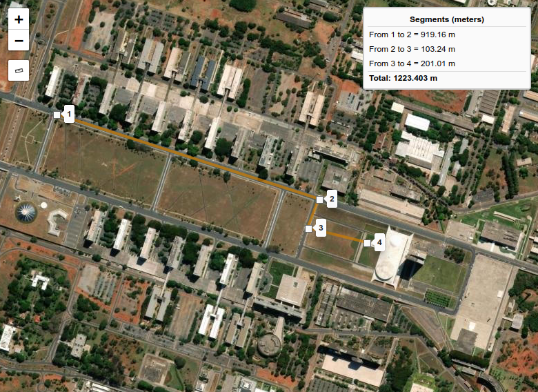

# Leaflet.QgsMeasure

Leaflet control to measure segment distances on the map like Qgis Ruler.

Requires [Leaflet](https://github.com/Leaflet/Leaflet/releases) 1.0.0+ branches

Requires [Leaflet.Draw](https://github.com/leaflet/Leaflet.Draw#readme)

## Install

```shell
npm install leaflet-qgsmeasure
```

## Demo

Check out the [demo](https://gabriel-russo.github.io/Leaflet.QgsMeasure/example/)



## Usage

As map option:

```js
const map = L.map('map', { measureControl: true });
```

Or like any control:

```js
const options = {}; // See docs to see options
L.Control.qgsmeasure(options)
  .addTo(map);
```

## Docs

### Options:

```js
// Default plugin options object, change wathever you want
options = {
  position: 'topleft',
  shapeOptions: {
    color: "#d07f03",
    stroke: true,
    weight: 4,
    opacity: 0.7,
  },
  icon: new L.DivIcon({
    iconSize: new L.Point(9, 9),
    className: 'leaflet-div-icon leaflet-editing-icon',
  }),
  text: {
    title: 'Measure distances', // Plugin Button Text
    segments_title: 'Segments (meters)', // Segments box title
    segments_from: "From ", // Segment start label
    segments_to: "to ", // Segment end label
    segments_total: 'Total: ', // Total distance label
    segments_meters: "m", // Meters label
  },
};
```

### Events:

* `qgsmeasure:measurestart` - Event fired when the measure starts
* `qgsmeasure:newsegment` - Event fired when a new segment/vertex is added
  ```js
  // Event data example:
  {
    segments: [ // List with every segment on map
      {
        from: 1,
        to: 2,
        distance: 729.5775168261067
      },
      {
        from: 2,
        to: 3,
        distance: 420.2680458268559
      },
    ],
    type: "qgsmeasure:newsegment",
  // target ...,
  // sourceTarget...,
  }
  ```
* `qgsmeasure:measurestop` - Event fired when the measure stops

### Custom html button

If you are developing a web application and you want to use your own html button outside the map container, you can use
the following code:

```javascript
const options = {
  button: document.getElementById('my-button'), // Your html button HTML reference
}

const control = L.Control.qgsmeasure(options)
  .addTo(map);
```

After that, you have to make your own segments output box using the events described above.

You can see the example [here](https://gabriel-russo.github.io/Leaflet.QgsMeasure/example/with-button.html)

## Development

```shell
npm install --save-dev     # install dependencies
npm run dev  # Compile and save at dist/ after any change
```

Open `index.html` in your browser and start editing.

## Changelog

See [CHANGELOG.md](./CHANGELOG.md).

## Authors

* Gabriel Russo

## Forked from (Credits)

* Gilles Bassière
* Alexandra Janin
* Makina Corpus
